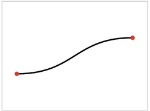
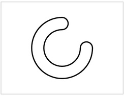

# Pathomorph.js

[](https://npmjs.org/package/pathomorph "View this project on npm")
[](http://opensource.org/licenses/MIT)

> Convert and construct SVG path data programmatically.

Pathomorph is a compact utility for generating SVG path strings from geometric primitives and curves. It offers both transformation routines—such as converting rectangles or circles to path data and on the other hand path construction helpers like curved connectors, arrows, and rounded corners.


---

## Example

```html
<svg width="300" height="200" xmlns="http://www.w3.org/2000/svg">
  <path id="rounded" stroke="#3498db" fill="none" stroke-width="4"/>
  <path id="connector" stroke="#e74c3c" fill="none" stroke-width="3"/>
  <path id="arrow" stroke="#2ecc71" fill="none" stroke-width="2"/>
</svg>

<script type="module">
  import Pathomorph from 'pathomorph';

  const p1 = { x: 20, y: 20 };
  const p2 = { x: 180, y: 120 };
  const from = { x: 30, y: 150 };
  const to = { x: 250, y: 50 };

  document.getElementById('rounded')
    .setAttribute('d', Pathomorph.RoundedRect(p1, p2, 15, 15));

  document.getElementById('connector')
    .setAttribute('d', Pathomorph.CurvedLine(from, to, 0.4));

  document.getElementById('arrow')
    .setAttribute('d', Pathomorph.ArrowTip(from, to));
</script>
```

---

## Installation

You can install `Pathomorph.js` via npm:

```bash
npm install pathomorph
```

Or with yarn:

```bash
yarn add pathomorph
```

Alternatively, download or clone the repository:

```bash
git clone https://github.com/rawify/Pathomorph.js
```

**Browser**

```html
<script src="js/pathomorph.min.js"></script>
<!-- Access via global `Pathomorph` -->
```

---

## API Documentation

All functions return a string suitable for use as an SVG path `d` attribute.
---

### Line(p1, p2)

Creates a straight line.


```js
Pathomorph.Line({ x: 0, y: 0 }, { x: 100, y: 0 })
// "M0 0L100 0"
```

---

### LineOffset(p1, p2, offsetA = 0, offsetB = 0)

Creates a line shortened on both ends by fixed distances.


* Useful for offsetting lines for arrows or gaps.
* Returns `""` if offsets exceed length.

```js
Pathomorph.LineOffset({ x: 0, y: 0 }, { x: 100, y: 0 }, 10, 10)
// "M10 0L90 0"
```

---

### Rectangle(p1, p2)

Generates a rectangular path between two diagonal points.


```js
Pathomorph.Rectangle({ x: 10, y: 10 }, { x: 60, y: 40 })
// "M10 10L10 40L60 40L60 10z"
```

---

### Circle(center, radius)

Shortcut for `Ellipse(center, radius, radius)`. Produces a circular path.


```js
Pathomorph.Circle({ x: 50, y: 50 }, 20)
```

---

### Ellipse(center, rx, ry, rotation = 0)

Draws a full ellipse using two 180° arc segments.


```js
Pathomorph.Ellipse({ x: 60, y: 40 }, 30, 20)
// Draws a full ellipse using two arcs
```

---

### Arc(center, radius, startAngle = 0, endAngle = TAU)

Draws a circular arc from `startAngle` to `endAngle`. Handles full circles automatically.


```js
Pathomorph.Arc({ x: 100, y: 100 }, 50, 0, Math.PI)
// Half-circle from 0 to π
```

---

### Polyline(points)

Connects a series of points with straight lines.


```js
Pathomorph.Polyline([
  { x: 10, y: 10 },
  { x: 40, y: 20 },
  { x: 80, y: 10 }
])
// "M10 10L40 20L80 10"
```

---

### Polygon(points)

Same as `Polyline` but closes the shape with a `"z"` command.


```js
Pathomorph.Polygon([
  { x: 10, y: 10 },
  { x: 40, y: 20 },
  { x: 80, y: 10 }
])
// "M10 10L40 20L80 10z"
```

---

### RoundedRect(p1, p2, rx = 0, ry = 0)

Creates a rectangle with rounded corners. The rounding radii are clamped automatically if too large.


```js
Pathomorph.RoundedRect({ x: 20, y: 20 }, { x: 120, y: 80 }, 10, 10)
```

---

### CurvedHorizontalLine(p1, p2)

Creates a horizontal S-curve between two points using a cubic Bézier.



```js
Pathomorph.CurvedHorizontalLine({ x: 20, y: 50 }, { x: 200, y: 90 })
```

---

### CurvedVerticalLine(p1, p2)

Same as `CurvedHorizontalLine` but curves vertically.


```js
Pathomorph.CurvedVerticalLine({ x: 100, y: 20 }, { x: 120, y: 140 })
```

---

### CurvedLine(a, b, curvature = 0.5)

Draws a cubic Bézier from `a` to `b`, with curvature perpendicular to the line direction.

* `curvature` controls bend magnitude (positive = right-turn from A→B)


```js
Pathomorph.CurvedLine({ x: 30, y: 150 }, { x: 250, y: 50 }, 0.4)
```

---

### ArrowTip(a, b)

Draws an arrowhead at `b`, pointing from `a` to `b`.

* Returns a closed path suitable for filling.


```js
Pathomorph.ArrowTip({ x: 50, y: 50 }, { x: 100, y: 100 })
// Arrowhead pointing from (50, 50) to (100, 100)
```

---

### FilletCorner(A, B, C, radius)

Rounds the corner at `B` (where A→B→C forms a bend) with a circular arc of given `radius`.


```js
Pathomorph.FilletCorner(
  { x: 20, y: 60 },
  { x: 60, y: 60 },
  { x: 60, y: 20 },
  10
)
```

---

### PartialPolyline(points, fraction)

Draws a partial polyline (first `fraction` ∈ \[0,1] of total length).

* Useful for animation or stroke-drawing effects.


```js
Pathomorph.PartialPolyline([
  { x: 0, y: 0 },
  { x: 100, y: 0 },
  { x: 100, y: 100 }
], 0.5)
// Draws the first 50% of the total polyline length
```

---

### RingSegment(center, radius, thickness, startAngle, endAngle)

Draws a donut slice (thick circular arc), capped at both ends with rounded edges.



```js
Pathomorph.RingSegment(
  { x: 100, y: 100 },
  60,
  20,
  0,
  Math.PI / 2
)
// Quarter ring segment
```

---


## Coding Style

As every library I publish, Pathomorph.js is also built to be as small as possible after compressing it with Google Closure Compiler in advanced mode. Thus the coding style orientates a little on maxing-out the compression rate. Please make sure you keep this style if you plan to extend the library.

## Building the library

After cloning the Git repository run:

```
npm install
npm run build
```

## Copyright and Licensing

Copyright (c) 2025, [Robert Eisele](https://raw.org/)
Licensed under the MIT license.
